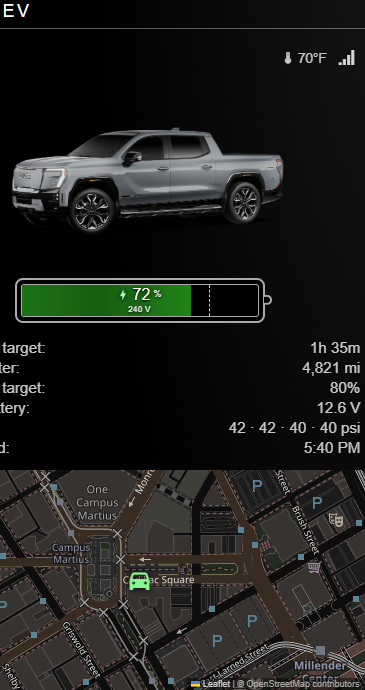
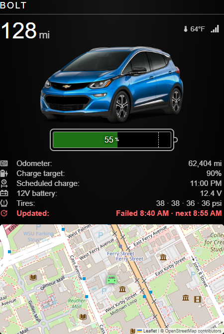
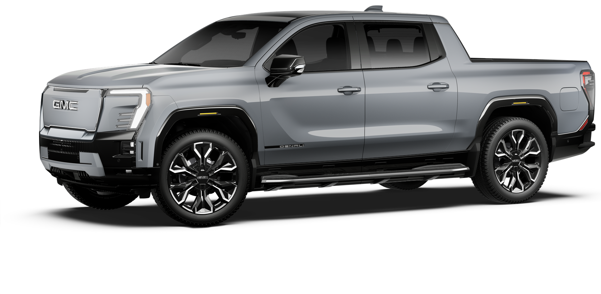
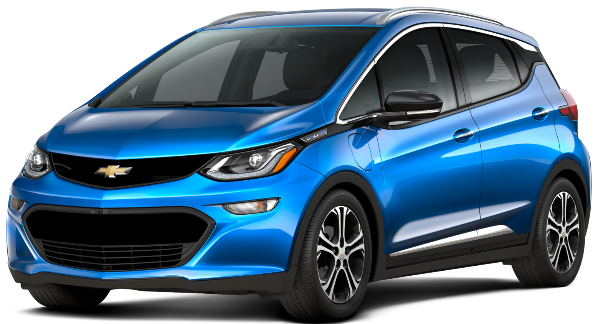

# MMM-GeneralMotorsEV

MagicMirror² module for GM EVs using the same OnStar / myGMC cloud API as the myGMC, myChevrolet, myBuick, and myCadillac apps.

The layout combines the car graphic (car overlay, large state of charge, status icons, Teslamate-style battery cell with charge-target marker and SOC overlay) with a map of the vehicle’s GPS position.





## Features

- Reads live vehicle data from GM OnStar (diagnostics, EV charging metrics, location)
- One MagicMirror module instance per vehicle; add as many cars as you have VINs
- Scheduled refresh (`refreshInterval` in seconds)
- Caches OnStar/Microsoft tokens, a stable device id, and the last successful snapshot under `cache/`
- Optional local car image (bundled Sierra EV and Bolt shots, a custom file, or the image URL GM returns)
- Metric grid includes **odometer**, **charge target** (not oil life), **12V battery**, and **all four tire pressures** (values only, one line) when the API provides them
- Demo mode for layout preview without credentials

## Screenshots

The bundled preview uses the same CSS as the MagicMirror module:

| Sierra EV (charging) | Bolt EV (unplugged) |
| --- | --- |
|  |  |

The graphic uses official GM studio CGI in a matching 3/4 front view:

- `images/cars/gmc-sierra-ev-denali-thunderstorm-gray.png` — 2025 GMC Sierra EV Denali, Thunderstorm Gray
- `images/cars/chevrolet-bolt-2017-blue.png` — 2017 Chevrolet Bolt EV Premier, Kinetic Blue





## Requirements

- [MagicMirror²](https://magicmirror.builders/) with Node.js 18+
- An OnStar-connected GM vehicle and an active plan that can return diagnostics and/or EV metrics
- OnStar MFA set to **Third-Party Authenticator App**, with the TOTP secret captured during setup
- US or Canadian OnStar account (same limitation as OnStarJS)

This module talks to GM through [onstarjs2](https://www.npmjs.com/package/onstarjs2). GM’s login is bot-gated; the first authentication can fail with “Access Denied”. If that happens, wait several hours, or drop a `microsoft_tokens.json` from the [OnStar Auth Token Saver](https://github.com/metheos/onstar_firefox) into the account cache folder (see below).

## Installation

```bash
cd ~/MagicMirror/modules
git clone https://github.com/maxbethge/MMM-GeneralMotorsEV
cd MMM-GeneralMotorsEV
npm install
```

Add one config block per vehicle in `config/config.js`.

## Configuration

```javascript
{
  module: "MMM-GeneralMotorsEV",
  position: "top_right",
  header: "Sierra EV",
  config: {
    username: "you@email.com",
    password: "your-gm-password",
    totpSecret: "BASE32TOTPSECRET",
    onStarPin: "1234",
    vin: "1GTYOURSIERRAVIN000",
    displayName: "Sierra EV",
    carImage: "sierra-ev",
    refreshInterval: 900,
    imperial: true,
    rangeDisplay: "%",
    hybridView: true,
    showMap: true
  }
},
{
  module: "MMM-GeneralMotorsEV",
  position: "top_left",
  header: "Bolt",
  config: {
    username: "you@email.com",
    password: "your-gm-password",
    totpSecret: "BASE32TOTPSECRET",
    onStarPin: "1234",
    vin: "1G1YOURBOLTVIN00000",
    displayName: "Bolt",
    carImage: "bolt",
    mapStyle: "light",
    showHeader: true,
    metricOptions: {
      fontSize: "0.95rem",
      lineHeight: "1.25rem",
      spacing: 0
    },
    refreshInterval: 900,
    imperial: true
  }
}
```

Shared GM credentials are cached once per account. Each instance only needs its own `vin` (and optional `carImage` / `displayName`).

MagicMirror sends `config.js` to the browser, so prefer environment variables for secrets: `GM_USERNAME`, `GM_PASSWORD`, `GM_TOTP`, `GM_PIN`. After the first successful login, OnStar tokens in `cache/` are reused so the password is not needed on every poll.

### Options

| Key | Default | Description |
| --- | --- | --- |
| `username` / `password` | — | GM account used by myGMC / myChevrolet |
| `totpSecret` | — | Authenticator secret (`onStarTOTP` is accepted as an alias) |
| `onStarPin` | — | OnStar PIN |
| `deviceId` | auto | UUID v4; generated once and cached per account |
| `vin` | — | Vehicle identification number |
| `displayName` | VIN / nickname | Label used for the header and image alt text |
| `showHeader` | `true` | Show the vehicle name. Set `false` to hide both MagicMirror’s `header` and the in-module title |
| `metricOptions.fontSize` | `"0.95rem"` | Font size for metric labels (odometer, tires, …). Number is px |
| `metricOptions.valueFontSize` | same as `fontSize` | Font size for metric values |
| `metricOptions.lineHeight` | `"1.25rem"` | Line height of each metric row |
| `metricOptions.spacing` | `0` | Extra gap between metric rows |
| `metricOptions.valueSpacing` | `12` | Space between the label and the value |
| `refreshInterval` | `900` | Time between API polls. Numbers below `60000` are **seconds** (`900` = 15 min). `60000` or more is treated as milliseconds. Minimum 60s. Each poll is logged as `[MMM-GeneralMotorsEV] … poll done … next in …` |
| `forceRefreshEV` | `false` | `false` reads GM’s cached EV metrics. `true` wakes the vehicle for live SOC, but only as often as `forceRefreshEVInterval` |
| `forceRefreshEVInterval` | same as `refreshInterval` | How often to call `refreshEVChargingMetrics` when `forceRefreshEV` is `true`. Same number rules as `refreshInterval`. Other polls (`diagnostics`, cached EV get, location) still use `refreshInterval` |
| `timeFormat` | `12` | `12` shows `1:07 PM`. `24` shows `13:07`. Independent of the Pi’s locale |
| `imperial` | `true` | Miles, °F, psi. `false` uses km, °C, kPa |
| `rangeDisplay` | `"%"` | `"%"` or `"range"` for the large number |
| `hybridView` | `true` | Show the metric grid under the graphic |
| `showMap` | `true` | Leaflet map using GPS from OnStar. Recovers after [MMM-Scenes2](https://github.com/MMRIZE/MMM-Scenes2) hide/show (and other `display:none` hides) by keeping the map instance and calling `invalidateSize` when the module is visible again |
| `mapHeight` / `mapWidth` | `"220px"` / `"100%"` | Map container size |
| `zoomLevel` | `16` | Leaflet zoom. Raise to `17`–`18` for more street names |
| `mapStyle` | `"dark"` | `"dark"` inverts OSM tiles for the mirror. `"light"` uses the same unfiltered OpenStreetMap tiles as [MMM-TeslamateLocation](https://github.com/donker/MMM-TeslamateLocation) (`teslamate` is an alias) |
| `tileUrl` | OpenStreetMap | OSM-compatible tile URL (TeslamateLocation’s default) |
| `tileLabelUrl` | `null` | Optional second tile layer (labels-only overlay) |
| `tileAttribution` | OSM contributors | Leaflet attribution string |
| `mapTileFilter` | invert / hue-rotate | CSS filter on tiles for `mapStyle: "dark"`. Ignored when `mapStyle` is `"light"`. Set `false` to disable |
| `carImage` | `null` | See car images below |
| `carImageOptions.opacity` | `0.9` | Overlay fade |
| `carImageOptions.scale` | `1` | Image scale |
| `carImageOptions.verticalOffset` | `0` | Vertical shift in px |
| `demo` | `false` | Render bundled sample data; no GM login |

### Car images

`carImage` can be:

- An alias: `"sierra-ev"` or `"bolt"`
- A file inside the module, e.g. `"images/cars/my-yukon.png"`
- An absolute URL
- `false` / `"none"` to hide the vehicle image
- Omitted: uses GM’s `imageUrl` when the API returns one, otherwise guesses from make/model

The graphic is a dark stage with `object-fit: contain`, so a **transparent PNG**, 3/4 front view, vehicle facing **left**, matches the bundled Sierra and Bolt. Opacity defaults to `0.9`.

#### Adding a GM studio CGI (same method as Sierra / Bolt)

The bundled files are official GM merchandising renders from `cgi.gm.com`, not photos. They are ~1920×1080 transparent PNGs. Sierra uses camera `deg02`; Bolt uses `deg01`. Empty studio padding was trimmed with a **16px** margin so dark tires are not clipped.

**1. Get the CGI id**

On [gmc.com](https://www.gmc.com), [chevrolet.com](https://www.chevrolet.com), [cadillac.com](https://www.cadillac.com), or [buick.com](https://www.buick.com), open Build & Price (or a dealer inventory card) for the year, trim, and paint you want. Right-click the vehicle image → Copy image address, or inspect the `` `src`.

You want a URL like:

```
https://cgi.gm.com/mmgprod-us/dynres/prove/image.gen?i=YEAR/STYLE/STYLE__TRIM/COLOR_HTAgmds10.jpg&v=deg01&std=true&country=US
```

Hosts may be `cgi.gm.com`, `cgi.chevrolet.com`, `cgi.gmc.com`, and so on. The important part is `i=`:

| Piece | Sierra EV example | Bolt EV example |
| --- | --- | --- |
| Year / style / trim | `2025/TT35843/TT35843__5SD` | `2017/1FC48/1FC48__2LZ` |
| Paint RPO (3 letters before `_HTA`) | `GNO` Thunderstorm Gray | `GD1` Kinetic Blue |
| Angle that faces left | `v=deg02` | `v=deg01` |

A long inventory URL with dozens of RPO codes also works; you can paste it as-is. Prefer `…HTAgmds10.jpg` (studio) over `gmds2` / `gmds4` when both appear.

**2. Download angles and pick 3/4 left**

From the module folder:

```bash
python scripts/fetch-gm-cgi.py --id "YEAR/STYLE/STYLE__TRIM/COLOR_HTAgmds10.jpg" --preview-angles
```

Or paste the copied URL:

```bash
python scripts/fetch-gm-cgi.py --url "https://cgi.gm.com/mmgprod-us/dynres/prove/image.gen?i=..." --preview-angles
```

That writes `images/cars/_cgi_deg01.png` … `_deg08.png`. Keep the frame where the nose points left and you see the driver’s side (same as the bundled cars). `deg01` or `deg02` is usually that view; the rest are other rotations.

**3. Save the chosen angle and trim padding**

```bash
python scripts/fetch-gm-cgi.py \
  --id "2025/TT35843/TT35843__5SD/GNO_HTAgmds10.jpg" \
  --deg 2 \
  --out images/cars/my-sierra.png \
  --trim
```

`--trim` needs [Pillow](https://pypi.org/project/Pillow/) (`pip install pillow`). It crops transparent/black studio canvas and **keeps 16px**. Do not crop tighter than that; GM CGI tires and rockers are very dark and get clipped.

Without the script:

```bash
curl -A "Mozilla/5.0" -o images/cars/my-car.png \
  "https://cgi.gm.com/mmgprod-us/dynres/prove/image.gen?i=YEAR/STYLE/STYLE__TRIM/COLOR_HTAgmds10.jpg&v=deg02&std=true&country=US&transparentBackgroundPng=true"
```

Send a normal browser User-Agent; an empty one is often blocked.

**4. Point the module at the file**

```javascript
carImage: "images/cars/my-car.png",
carImageOptions: {
  opacity: 0.9,
  scale: 1,
  verticalOffset: 0
}
```

Restart MagicMirror (or refresh `preview/index.html`). Paths are relative to this module. You do not need to edit `MMM-GeneralMotorsEV.js` unless you want a short alias like `"sierra-ev"` (those live in `resolveCarImage()`).

Worked recreations of the bundled images:

```bash
python scripts/fetch-gm-cgi.py --id "2025/TT35843/TT35843__5SD/GNO_HTAgmds10.jpg" --deg 2 --out images/cars/gmc-sierra-ev-denali-thunderstorm-gray.png --trim
python scripts/fetch-gm-cgi.py --id "2017/1FC48/1FC48__2LZ/GD1_HTAgmds10.jpg" --deg 1 --out images/cars/chevrolet-bolt-2017-blue.png --trim
```

### Display toggles

```javascript
displayOptions: {
  odometer: { visible: true },
  chargeTarget: { visible: true },
  battery12v: { visible: true },
  tpms: { visible: true },
  batteryBar: { visible: true },
  temperatures: { visible: true }
}
```

Oil life is never shown. Charge target (`tcl` from EV metrics) occupies that slot. **Scheduled charge start** appears under it when diagnostics return `EV SCHEDULED CHARGE START`. The battery meter is a Teslamate-style cell (rounded body, plus-pole nub, green fill). SOC % is drawn on the cell; EV plug voltage (`EV PLUG VOLTAGE`) sits under it when the vehicle reports a non-zero AC input. The 12V battery (`INTERM VOLT BATT VOLT`) sits in the same grid as odometer. When all four TPMS values are present they appear on one line as pressure values only.

### Map tiles

The default map is **OpenStreetMap** with a CSS invert so it stays dark on the mirror. That is the same tile URL [MMM-TeslamateLocation](https://github.com/donker/MMM-TeslamateLocation) uses (`https://{s}.tile.openstreetmap.org/{z}/{x}/{y}.png`); TeslamateLocation leaves the tiles light.

If you hide this module on a rolling scene with [MMM-Scenes2](https://github.com/MMRIZE/MMM-Scenes2), the map stays alive while it is off-screen and redraws when the scene brings it back. MagicMirror’s hide path uses `display: none`, which makes Leaflet think the container is 0×0; the module listens for `resume`, `SCENES_CHANGED`, and container resizes so tiles and the marker catch up after the fade-in (default 1s). Polling continues in the helper while the module is hidden, so location is current when it reappears.

Match TeslamateLocation’s light street map:

```javascript
mapStyle: "light"
```

`light` (or `teslamate`) turns off the invert so streets, parks, and labels render in OSM’s normal colors. Zoom is unchanged (`16`); TeslamateLocation defaults to `20` if you want that closer view:

```javascript
mapStyle: "light",
zoomLevel: 20
```

Disable the invert without the preset if you switch to a tile set that is already dark:

```javascript
mapTileFilter: false
```

Esri Dark Gray (roads only, almost no names):

```javascript
tileUrl: "https://server.arcgisonline.com/ArcGIS/rest/services/Canvas/World_Dark_Gray_Base/MapServer/tile/{z}/{y}/{x}",
tileAttribution: "Tiles &copy; Esri",
mapTileFilter: false
```

Carto Dark Matter (dark + labels) needs a free API key or it watermarks every tile:

```javascript
tileUrl: "https://{s}.basemaps.cartocdn.com/dark_all/{z}/{x}/{y}{r}.png?key=YOUR_KEY",
tileAttribution: "&copy; OpenStreetMap, &copy; CARTO",
tileSubdomains: "abcd",
mapTileFilter: false
```

## Credential cache

Tokens and device ids live in the module folder (not in the browser):

```
cache/accounts/<hash>/microsoft_tokens.json
cache/accounts/<hash>/gm_tokens.json
cache/accounts/<hash>/device-id.json
cache/snapshots/<VIN>.json
```

The snapshot is used to paint the module immediately on restart while a new poll runs. Do not commit `cache/`.

If automated login is blocked by Akamai, generate `microsoft_tokens.json` with the Firefox token saver and copy it into `cache/accounts/<hash>/`.

### `ENOTEMPTY ... temp-browser-profile`

The first GM login is done by **onstarjs2**, which launches Chromium with a profile at `~/MagicMirror/temp-browser-profile` (MagicMirror’s working directory, not this module). On Raspberry Pi that folder often cannot be deleted while Chromium is still shutting down, so a login retry throws `ENOTEMPTY`. Two vehicle instances logging in at the same time hit the same folder.

This module retries/renames that profile and runs vehicle polls one at a time. If you still see the error:

```bash
rm -rf ~/MagicMirror/temp-browser-profile ~/MagicMirror/temp-browser-profile.stale-*
```

Then restart MagicMirror. Seeding `microsoft_tokens.json` skips Chromium after the first successful login.

## Demo / preview

```javascript
config: {
  demo: true,
  vin: "bolt",
  displayName: "Bolt",
  carImage: "bolt"
}
```

A standalone HTML preview (same CSS and car images) is at `preview/index.html`.

## What is polled

Each cycle, per VIN:

1. `diagnostics()` — odometer, 12V, **tire pressures**, EV battery/range when the plan allows it
2. `getEVChargingMetrics()` — SOC, charge target (`tcl`), plug/charge state, GPS, ETA
3. `location()` — fallback coordinates from the digital twin
4. `getVehicleDetails()` — make/model/year/nickname/image when available

Tire pressures come from `diagnostics()`, not from the EV metrics call. A 429 on any call honors `Retry-After` (or backs off to 2× `refreshInterval` if the header is missing) and delays the next poll. The module shows **Next refresh** under **Updated** while that wait is in effect.

Connected Access plans often 403 diagnostics; EV metrics still populate SOC, range, and charge target.

Each poll writes a line to the MagicMirror log, for example:

```
[MMM-GeneralMotorsEV] MMM-GeneralMotorsEV [module_28_MMM-GeneralMotorsEV] Sierra EV poll done in 4120ms diag=ok ev=ok loc=ok details=ok soc=72 tires=42/42/40/40 psi stale=false vin=... id=module_28_MMM-GeneralMotorsEV evCall=getEVChargingMetrics nextPoll=15m
[MMM-GeneralMotorsEV] MMM-GeneralMotorsEV [module_28_MMM-GeneralMotorsEV] Sierra EV next poll in 15m
```

A 429 includes Retry-After and the delayed next poll:

```
[MMM-GeneralMotorsEV] MMM-GeneralMotorsEV [module_28_MMM-GeneralMotorsEV] Colossus poll done in 8120ms diag=ok ev=fail:Request Failed with status 429 - Too Many Requests loc=ok details=ok soc=61.4 ... nextPoll=15m throttle=status=429 retry-after=180 wait=3m
[MMM-GeneralMotorsEV] MMM-GeneralMotorsEV [module_28_MMM-GeneralMotorsEV] Colossus throttle status=429 retry-after=180 wait=3m next-poll=15m (refresh 15m)
[MMM-GeneralMotorsEV] MMM-GeneralMotorsEV [module_28_MMM-GeneralMotorsEV] Colossus next poll in 15m
```

If `forceRefreshEV` is `false` (the default), `getEVChargingMetrics` returns GM’s last cached EV packet. The poll still runs; SOC and plug state may stay the same until the vehicle next reports. Set `forceRefreshEV: true` and `forceRefreshEVInterval: 3600` to wake the vehicle about once an hour while still polling diagnostics every `refreshInterval`. Do not force-refresh faster than about every 5 minutes.

## Disclaimer

This is an unofficial integration. GM can change or block the consumer API at any time. Remote commands (lock, start, charge control) are intentionally not exposed on a wall mirror.

## Credits

- Visual language inspired by [MMM-Teslamate](https://github.com/denverquane/MMM-Teslamate) and [MMM-TeslamateLocation](https://github.com/donker/MMM-TeslamateLocation)
- GM API client: [OnStarJS2](https://github.com/BigThunderSR/OnStarJS)
- Bundled studio images from GM’s public CGI image service (`cgi.gm.com`)
