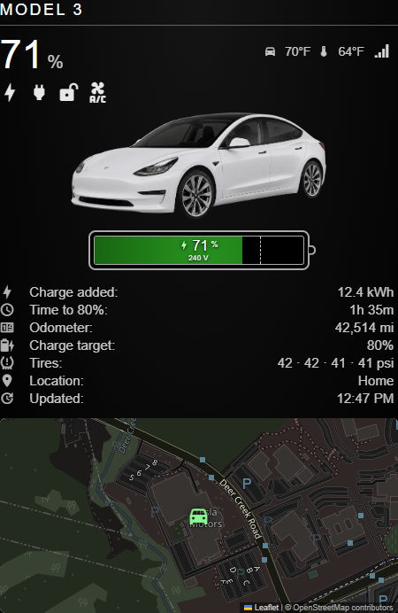
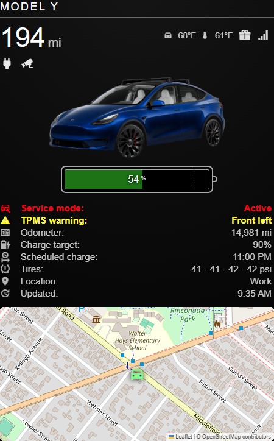
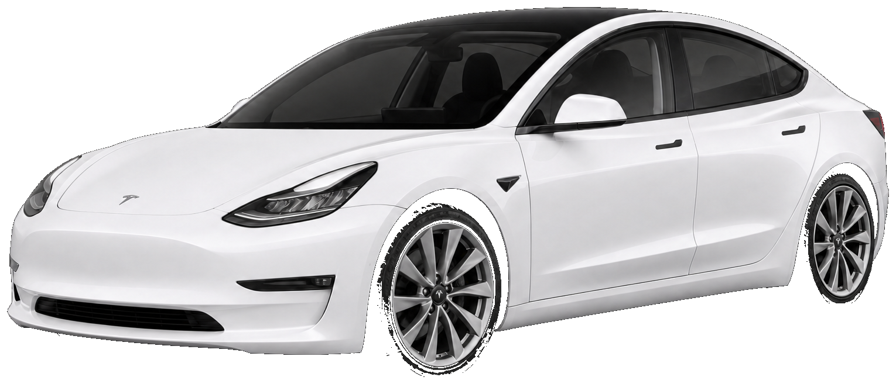
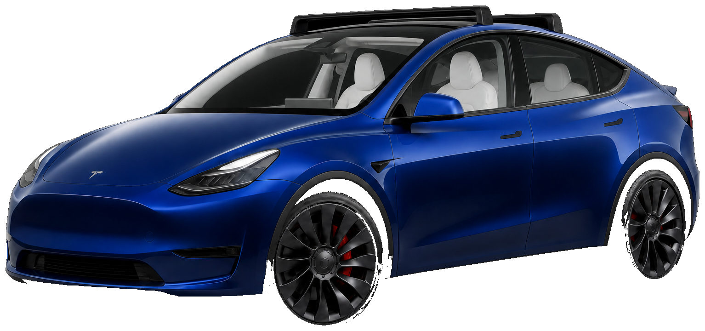

# MMM-TeslamateWithLocation

MagicMirror² module for Tesla vehicles tracked by [Teslamate](https://github.com/teslamate-org/teslamate). It combines [MMM-Teslamate](https://github.com/denverquane/MMM-Teslamate) MQTT stats with an [MMM-TeslamateLocation](https://github.com/donker/MMM-TeslamateLocation) map in one module: car graphic, large SOC or range, status icons, battery cell, hybrid metric list, and a Leaflet map of the car’s GPS position.





## Features

- Live Teslamate MQTT topics (battery, climate, TPMS, charge, geofence, speed, lat/lon, and the newer `location` JSON)
- One MagicMirror instance per car; multiple cars share one MQTT connection per broker without config or update collisions
- Teslamate hybrid stats under the car graphic and battery cell
- Leaflet map of Teslamate GPS, with hide/show recovery for [MMM-Scenes2](https://github.com/MMRIZE/MMM-Scenes2)
- Bundled example images: white 2018 Model 3 and blue 2023 Model Y Performance
- Demo mode for layout preview without a broker

## Screenshots

`preview/index.html` uses this module’s CSS and the bundled Tesla images:

| Model 3 (charging) | Model Y Performance (scheduled charge) |
| --- | --- |
|  |  |

Vehicle images used in the graphic:

- `images/cars/tesla-model-3-2018-pearl-white.png` — 2018 Tesla Model 3, Pearl White Multi-Coat, 18" alloy rims (aero covers off)
- `images/cars/tesla-model-y-2023-performance-deep-blue.png` — 2023 Tesla Model Y Performance, Deep Blue Metallic, Tesla roof rack, white interior





## Requirements

- [MagicMirror²](https://magicmirror.builders/) with Node.js 18+
- Teslamate with MQTT publishing enabled
- An MQTT broker Teslamate already publishes to (often Mosquitto)

## Installation

```bash
cd ~/MagicMirror/modules
git clone https://github.com/maxbethge/MMM-TeslamateWithLocation
cd MMM-TeslamateWithLocation
npm install
```

Add one config block per vehicle in `config/config.js`.

## Configuration

Teslamate-style `mqttServer` + `carID`, TeslamateLocation-style `mqttServerAddress` / `mqttTopic`, or both:

```javascript
{
  module: "MMM-TeslamateWithLocation",
  position: "top_right",
  header: "Model 3",
  config: {
    mqttServer: {
      address: "192.168.1.8",
      port: 1883
      // user: "user",
      // password: "password"
    },
    carID: "1",
    displayName: "Model 3",
    carImage: "model3",
    imperial: true,
    rangeDisplay: "%",
    hybridView: true,
    showMap: true,
    showTemps: "always"
  }
},
{
  module: "MMM-TeslamateWithLocation",
  position: "top_left",
  header: "Model Y",
  config: {
    mqttServerAddress: "192.168.1.8",
    mqttServerPort: 1883,
    mqttTopic: "teslamate/cars/2",
    displayName: "Model Y",
    carImage: "modely",
    mapStyle: "light",
    imperial: true,
    rangeDisplay: "range"
  }
}
```

Each instance is keyed by MagicMirror’s module `identifier` plus `carID`. Logs look like:

```
[MMM-TeslamateWithLocation] MMM-TeslamateWithLocation [module_12_MMM-TeslamateWithLocation] Model 3 MQTT 192.168.1.8:1883 carID=1 prefix=teslamate/cars/1 topics=54
```

Two instances never share vehicle state. The helper reuses one MQTT client per broker and reference-counts topics, so a second car does not drop the first subscription.

### Options

| Key | Default | Description |
| --- | --- | --- |
| `mqttServer.address` / `port` / `user` / `password` | — | Teslamate MQTT broker. `mqttServerAddress`, `mqttServerPort`, `mqttServerUser`, `mqttServerPassword` are aliases |
| `carID` | `"1"` | Teslamate car id |
| `mqttTopic` | `teslamate/cars/{carID}` | TeslamateLocation-style prefix. The module appends `/latitude`, `/longitude`, `/battery_level`, … |
| `mqttNamespace` | — | Optional Teslamate MQTT namespace (`{ns}/teslamate/cars/{id}/…`) |
| `displayName` | MQTT `display_name` | Label used in logs, header, and image alt text |
| `demo` | `false` | Render bundled sample data; no MQTT |
| `imperial` | `false` | Miles, °F, psi. `false` uses km, °C, bar (Teslamate native) |
| `rangeDisplay` | `"%"` | `"%"` or `"range"` for the large number |
| `hybridView` | `true` | Metric list under the graphic (Teslamate hybrid view) |
| `showMap` | `true` | Leaflet map from Teslamate GPS. Recovers after MMM-Scenes2 hide/show |
| `mapHeight` / `mapWidth` | `"220px"` / `"100%"` | Map size. `height` / `width` from TeslamateLocation also work |
| `zoomLevel` | `16` | Leaflet zoom. TeslamateLocation used `20` for a closer street view |
| `mapStyle` | `"dark"` | `"dark"` inverts OSM tiles. `"light"` / `"teslamate"` / `"teslamatelocation"` matches TeslamateLocation |
| `tileUrl` | OpenStreetMap | OSM-compatible tile URL |
| `tileLabelUrl` | `null` | Optional labels-only overlay |
| `carImage` | guessed | `"model3"` / `"modely"`, a file in the module, a URL, or `false` |
| `carImageOptions` | see below | Tesla compositor fallback (`model`, `view`, `options`) plus `opacity` / `scale` / `verticalOffset` |
| `showTemps` | `"hvac_on"` | `"always"`, `"hvac_on"`, or `"never"` |
| `updatePeriod` | `5` | Seconds to wait before re-rendering while MQTT is streaming |
| `timeFormat` | `12` | `12` or `24` |
| `showHeader` | `true` | Set `false` to hide MagicMirror `header` and the in-module title |
| `metricOptions` | see below | Font size / line height for the metric list. Teslamate `sizeOptions.fontSize` / `lineHeight` are aliases |

### Size and display toggles

```javascript
sizeOptions: {
  width: 450,
  height: 175,
  batWidth: 250, // batWitdh also accepted
  batHeight: 45,
  topOffset: 0
},
displayOptions: {
  odometer: { visible: true },
  chargeTarget: { visible: true },
  chargeAdded: { visible: true },
  batteryBar: { visible: true, topMargin: 0 },
  temperatureIcons: { topMargin: 0 },
  temperatures: { visible: true },
  tpms: { visible: true },
  tpmsWarnings: { visible: true },
  serviceMode: { visible: true },
  speed: { visible: true },
  geofence: { visible: true }
},
carImageOptions: {
  model: "m3",
  view: "STUD_3QTR",
  options: "PPSW,W38B",
  opacity: 0.9,
  scale: 1,
  verticalOffset: 0
}
```

### Second-level metrics

When `hybridView` is true the list shows Teslamate’s hybrid-view rows:

- **Service mode** (red) when `service_mode` is true
- **TPMS warning** (yellow) listing corners with `tpms_soft_warning_*` true
- **Charge added** and **Time to {limit}%** while charging
- **Scheduled charge** when plugged in with `scheduled_charging_start_time`
- **Odometer**
- **Charge target** (`charge_limit_soc`)
- **Tires** (all four TPMS values Teslamate publishes in bar)
- **Location** (geofence)
- **Speed** while `state` is `driving`
- **Updated** (last MQTT payload)

Hide the alert rows with `displayOptions.serviceMode.visible: false` or `displayOptions.tpmsWarnings.visible: false`. They are omitted when Teslamate reports false.

Graphic status icons cover Teslamate’s asleep / driving / plug / lock / sentry / windows / occupant / doors / climate states. The battery cell shows usable SOC, optional cold-battery reserve, the charge-limit marker, and charger voltage only during an active charge (Teslamate’s 1–2V disconnected sentinel is ignored).

### Map and MMM-Scenes2

MQTT stays connected while the module is hidden. The Leaflet instance is kept across `updateDom` and `invalidateSize` is called on `resume`, `SCENES_CHANGED`, and container resize so tiles are not stuck at 0×0 after MagicMirror’s `display: none`.

Match TeslamateLocation’s light OSM tiles:

```javascript
mapStyle: "light",
zoomLevel: 20
```

### Car images

`carImage` can be:

- An alias: `"model3"` / `"m3"` or `"modely"` / `"my"`
- A file inside the module, e.g. `"images/cars/my-s.png"`
- An absolute URL
- `false` / `"none"` to hide the image
- Omitted: guesses from `displayName` / `carID`, then Teslamate-style compositor options

The bundled files are 3/4-front studio shots (facing left) with the backdrop removed. To replace them with Tesla Design Studio compositor CGI (when Tesla’s CDN allows it):

```bash
python scripts/fetch-tesla-cgi.py --model m3 --options PPSW,W38B --out images/cars/tesla-model-3-2018-pearl-white.png --trim
python scripts/fetch-tesla-cgi.py --model my --options PPSB,WY21P,MTY09 --out images/cars/tesla-model-y-2023-performance-deep-blue.png --trim
```

`--trim` needs [Pillow](https://pypi.org/project/Pillow/).

## Multiple instances

Do **not** copy the original MMM-Teslamate helper’s single global MQTT client. This module:

- Tags every socket payload with `identifier` and `carID`
- Ignores updates meant for another instance, even if both cars share a broker
- Labels every log line with `[module_…_MMM-TeslamateWithLocation]` and the display name
- Keeps MQTT alive across MMM-Scenes2 hide/show so both cars stay current

## Demo / preview

```javascript
config: {
  demo: true,
  carID: "1",
  displayName: "Model 3",
  carImage: "model3",
  imperial: true
}
```

Standalone HTML preview of both example Teslas: `preview/index.html`.

## Credits

- Stats topics and hybrid metrics from [MMM-Teslamate](https://github.com/denverquane/MMM-Teslamate)
- Map MQTT + OSM tiles from [MMM-TeslamateLocation](https://github.com/donker/MMM-TeslamateLocation)
- Vehicle data: [Teslamate](https://github.com/teslamate-org/teslamate)
- Bundled studio images of a white 2018 Model 3 (18" alloy rims) and a blue 2023 Model Y Performance (roof rack, white interior)
